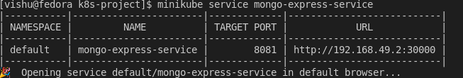
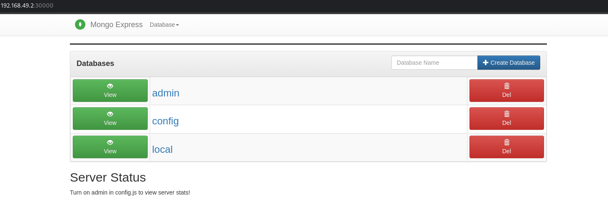

# Introduction
A simple kubernetes project using Mongo-DB & Mongo-Express to learn about kubernetes concepts like services, secrets, configmaps, deployment etc.
# Pre-requisties 
1) Docker
2) Minikube
3) Kubernetes

# Staring Docker & Minikube
```
 systemctl start docker 
 minikube start
```
# Downloading files
```
 mkdir k8s-project
 cd k8s-project/
 git clone https://github.com/vishu-25/k8s-mongodb-mongoexpress 
 ```
# Deploying the pods
```
 cd yaml-files/
 kubectl apply -f mongo-secret.yaml
 kubectl apply -f mongo-configmap.yaml
 kubectl apply -f mongo.yaml
 kubectl apply -f mongo-express.yaml
```
Check the staus of the pods using `kubectl get pods` and wait till the pods are created.
# Getting an external service
Once the pods are deployed use 
``` 
  minkube service mongo-express-service
```


Copy paste the link in your browser or wait for minikube to open the link in your default browser

# Output



## License
[MIT](https://choosealicense.com/licenses/mit/)
